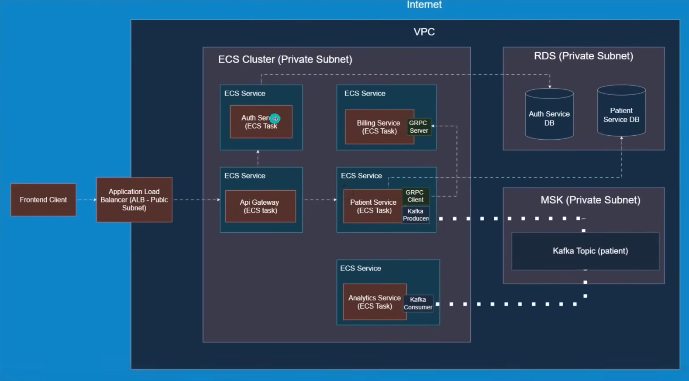

<div align="center">

# 🏥 Patient Management System

### A production-grade microservices backend built for learning & showcasing real-world distributed systems concepts

</div>


---

## 📌 Project Purpose

This is a **learning-focused, production-inspired** backend project. Rather than building a simple CRUD app, I intentionally chose a healthcare domain to implement and integrate multiple real-world distributed systems concepts — all in one cohesive system.

> **Key technologies explored:** Kafka, gRPC, API Gateway, Microservices, Integration Testing, Docker, JWT Auth

---

## 🏗️ Architecture Overview

```
                        ┌─────────────────────────────┐
                        │         API Gateway         │
                        │   (JWT Auth + Routing)      │
                        └──────────────┬──────────────┘
                                       │
              ┌────────────────────────┼───────────────────────┐
              │                        │                       │
    ┌─────────▼──────┐     ┌──────────▼──────┐     ┌──────────▼──────┐
    │Patient Service │     │  Auth Service   │     │ Billing Service │
    │  (REST + Kafka)│     │  (JWT tokens)   │     │    (gRPC)       │
    └─────────┬──────┘     └─────────────────┘     └─────────────────┘
              │
              │ Kafka Event
              ▼
    ┌──────────────────┐
    │ Analytics Service│
    │  (Kafka Consumer)│
    └──────────────────┘
```

### Communication Patterns Used

| Pattern | Where | Why |
|--------|-------|-----|
| **REST** | Client → API Gateway → Services | Standard HTTP for external APIs |
| **gRPC** | Patient Service → Billing Service | High-performance inter-service calls |
| **Kafka** | Patient Service → Analytics Service | Async event-driven communication |
| **JWT** | API Gateway ↔ Auth Service | Stateless authentication |

---

## 🔬 Services Breakdown

### 1. `api_gateway` — Entry Point
- Routes all external traffic to internal services
- Validates JWT tokens before forwarding requests
- Single entry point following the API Gateway pattern

### 2. `auth_service` — Authentication
- Issues and validates JWT tokens
- Stateless authentication — no session management

### 3. `patient_service` — Core Domain Service
- Full CRUD for patient records
- Publishes **Kafka events** on patient creation/update (e.g., `patient.created`)
- Calls `billing_service` via **gRPC** to initialize billing records

### 4. `billing_service` — gRPC Server
- Exposes a gRPC endpoint for billing operations
- Demonstrates Protocol Buffers (`.proto`) contract-first design

### 5. `analytics_service` — Kafka Consumer
- Listens to Kafka topics published by `patient_service`
- Processes events asynchronously — decoupled from the main flow

---

## 🧠 Concepts Learned & Implemented

| Concept | Implementation |
|--------|---------------|
| **Microservices** | 5 independent services, each with its own responsibility |
| **Apache Kafka** | Async event streaming between Patient and Analytics service |
| **gRPC** | Synchronous inter-service RPC between Patient and Billing |
| **API Gateway** | Centralized routing, auth, and request forwarding |
| **JWT Auth** | Token-based stateless authentication via Auth service |
| **Integration Testing** | Tests in `integration-tests/` covering cross-service flows |
| **Docker** | Each service containerized with its own `Dockerfile` |
| **Protocol Buffers** | `.proto` files defining gRPC contracts |

---


## 🚀 Getting Started

### Prerequisites
- Java 17+
- Docker & Docker Compose
- Maven

### Run with Docker

```bash
# Clone the repository
git clone https://github.com/vidhanshu37/patient_management_vid.git
cd patient_management_vid

# Start infrastructure (Kafka, Zookeeper, etc.)
docker-compose up -d

# Build and run each service
cd patient_service && mvn spring-boot:run
cd billing_service && mvn spring-boot:run
# ... and so on
```

### Run Integration Tests

```bash
cd integration-tests
mvn test
```

---

## 📡 API Overview

All requests go through the **API Gateway** (default: `http://localhost:4004`).

### Auth
```http
POST /auth/login         → Get JWT token
POST /auth/register      → Register a user
```

### Patients (requires JWT)
```http
GET    /api/patients       → List all patients
POST   /api/patients       → Create a patient (triggers Kafka + gRPC)
GET    /api/patients/{id}  → Get patient by ID
PUT    /api/patients/{id}  → Update patient
DELETE /api/patients/{id}  → Delete patient
```

> See the `api-requests/` folder for ready-to-use request files.

---

## 🧪 Testing Strategy

```
├── Unit Tests          → Per-service business logic
├── Integration Tests   → Cross-service flows (see integration-tests/)
└── Manual Tests        → REST via api-requests/, gRPC via grpc-requests/
```

---

## 🛠️ Tech Stack

| Layer | Technology |
|-------|-----------|
| Language | Java 17 |
| Framework | Spring Boot 3.x |
| Messaging | Apache Kafka |
| Inter-service RPC | gRPC + Protocol Buffers |
| Gateway | Spring Cloud Gateway |
| Auth | JWT (JSON Web Tokens) |
| Containerization | Docker |
| Build Tool | Maven |

---

## 📖 What I Learned

This project was built to go beyond tutorials and face real distributed system challenges:

- **Why Kafka over REST for analytics?** Decoupling — analytics shouldn't slow down patient creation
- **Why gRPC over REST for billing?** Type-safety and performance for internal sync calls
- **Why API Gateway?** Avoid clients knowing about every microservice's URL + centralize auth
- **Integration testing complexity** — testing across services requires careful orchestration

---

## 🗺️ Roadmap / Future Ideas

- [ ] Add service discovery with Eureka or Consul
- [ ] Add a Kafka dead letter queue for failed events
- [ ] Implement rate limiting at the API Gateway
- [ ] Saga Pattern for distributed transactions (e.g., patient creation + billing)]
- [ ] Idempotency keys for safe retries in REST calls

---

## 🤝 Contributing

This is a learning project, but PRs and suggestions are welcome! Open an issue or fork and submit a PR.

---

<div align="center">

Made with ❤️ by [Vidhanshu](https://github.com/vidhanshu37) — learning by building real things

</div>